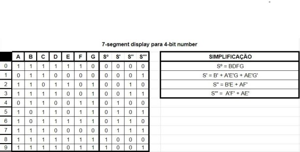
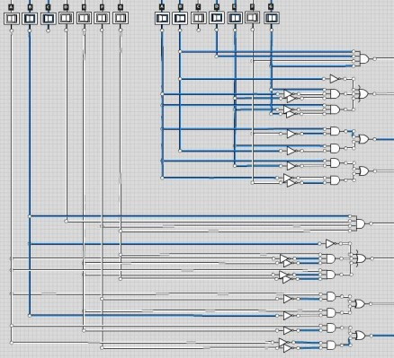
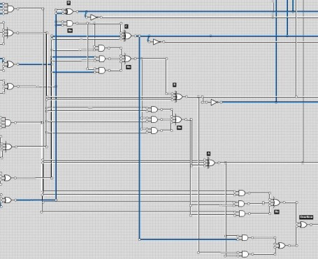
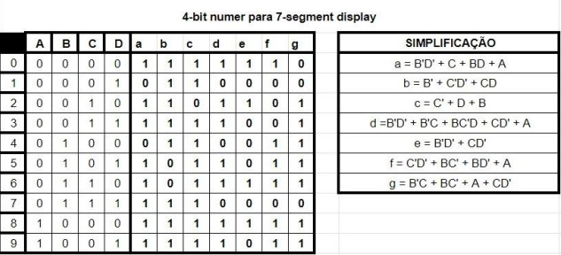
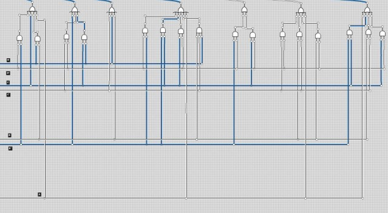
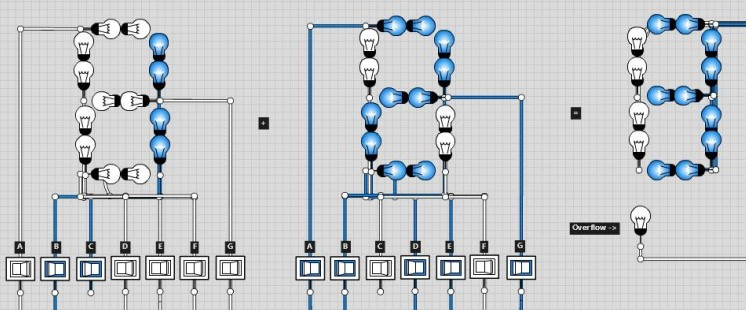

# Circuito-somador
Circuito somador feito usando operadores lógicos e gerando resultado em um visor de 7 segmentos

<h1>Tabela verdade do circuito conversor de 7 segmentos para 4 bits.<h1>
 
<h1>Circuito conversor de 7 segmentos para 4 bits.<h1>
 
<h1>Circuito somador dos números convertidos acima.<h1>
 
<h1>Tabela verdade do circuito conversor do resultado de 4 bits para 7 segmentos.<h1>
 
<h1>Circuito conversor do resultado de 4 bits para 7 segmentos.<h1>
 
<h1>Resultado nos visores.<h1>
 
